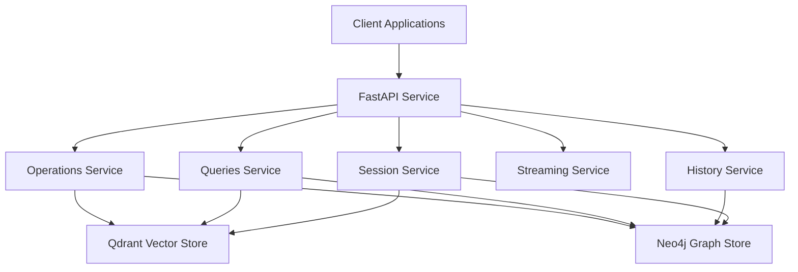
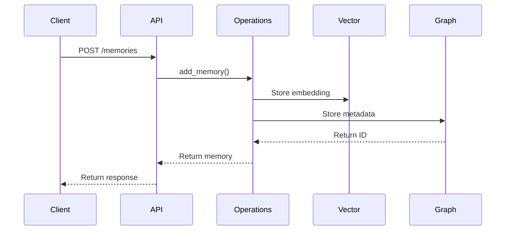
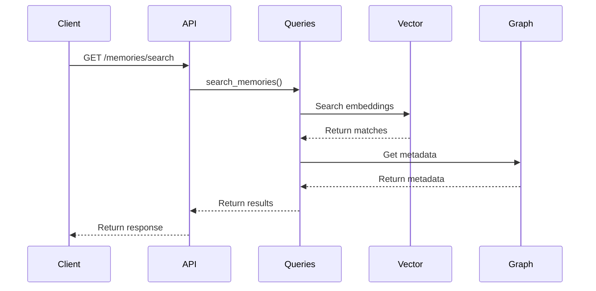
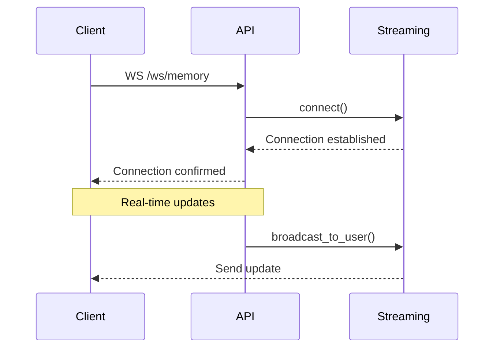

# Memory System Architecture

## Overview

The memory system is built as a microservice architecture with the following key components:



## Components

### API Layer

#### FastAPI Service
- Handles HTTP and WebSocket requests
- Manages authentication and authorization
- Implements rate limiting
- Provides OpenAPI documentation
- Handles error responses

#### Middleware
- Authentication middleware for JWT validation
- Rate limiting middleware for request throttling
- Error handling middleware for consistent responses
- CORS middleware for cross-origin requests
- Logging middleware for request tracking

### Service Layer

#### Operations Service
```python
class MemoryOperations:
    async def add_memory(messages: List[Dict], metadata: Dict) -> Dict
    async def update_memory(memory_id: str, updates: Dict) -> Dict
    async def delete_memory(memory_id: str) -> bool
    async def batch_update_memories(updates: List[Dict]) -> Dict
```

#### Queries Service
```python
class MemoryQueries:
    async def search_memories(query: str, filters: Dict) -> List[Dict]
    async def get_suggestions(query: str, limit: int) -> List[Dict]
    async def get_similar_memories(memory_id: str) -> List[Dict]
    async def get_memory_by_id(memory_id: str) -> Dict
```

#### History Service
```python
class MemoryHistory:
    async def get_memory_history(memory_id: str) -> List[Dict]
    async def get_memory_relations(memory_id: str) -> Dict
    async def add_relation(source_id: str, target_id: str) -> Dict
    async def remove_relation(relation_id: str) -> bool
```

#### Streaming Service
```python
class StreamingService:
    async def connect(websocket: WebSocket, user_id: str)
    async def disconnect(user_id: str)
    async def broadcast_to_user(user_id: str, message: Dict)
    async def stream_memory_chunks(content: str) -> AsyncGenerator
```

#### Session Service
```python
class SessionService:
    async def create_session(user_id: str) -> str
    async def get_session(session_id: str) -> Dict
    async def update_session(session_id: str, data: Dict) -> Dict
    async def delete_session(session_id: str) -> bool
```

### Data Layer

#### Vector Store (Qdrant)
- Stores memory embeddings
- Enables semantic search
- Handles similarity queries
- Manages vector indices
- Provides efficient retrieval

#### Graph Store (Neo4j)
- Stores memory relations
- Manages memory history
- Handles graph queries
- Maintains temporal data
- Supports complex relationships

## Data Flow

### Memory Creation


### Memory Query


### WebSocket Updates


## Security

### Authentication
- JWT-based authentication
- Token refresh mechanism
- Role-based access control
- Session management
- API key validation

### Rate Limiting
- Request rate limiting
- WebSocket message limiting
- IP-based throttling
- User-based quotas
- Burst handling

### Data Protection
- Input validation
- Output sanitization
- SQL injection prevention
- XSS protection
- CSRF protection

## Monitoring

### Logging
- Structured JSON logging
- Log levels configuration
- Request/response logging
- Error tracking
- Performance metrics

### Metrics
- Request latency
- Memory usage
- Database performance
- Cache hit rates
- Error rates

### Tracing
- Request tracing
- Service dependencies
- Performance bottlenecks
- Error propagation
- User flows

## Deployment

### Docker Containers
- API service container
- Vector store container
- Graph store container
- Test environment container
- Development container

### Infrastructure
- Container orchestration
- Load balancing
- Service discovery
- Health monitoring
- Auto-scaling

## Development

### Code Organization
```
src/
├── services/      # Business logic
├── routes/        # API endpoints
├── models/        # Data models
├── middleware/    # Request processing
├── websocket/     # Real-time handling
└── utils/         # Helper functions
```

### Testing Strategy
```
tests/
├── unit/         # Unit tests
├── integration/  # Integration tests
├── e2e/          # End-to-end tests
├── performance/  # Performance tests
└── fixtures/     # Test data
```

### Development Workflow
1. Local development
2. Automated testing
3. Code review
4. CI/CD pipeline
5. Deployment

## Future Enhancements

### Memory Compression
- Implement memory compression
- Add decompression service
- Optimize storage usage
- Handle compressed queries
- Maintain data integrity

### Memory Bridge
- Cross-session bridging
- Memory context sharing
- Relationship inference
- Context preservation
- State management

### Memory Suggestions
- Intelligent suggestions
- Context-aware recommendations
- Relevance scoring
- User preference learning
- Adaptive suggestions

### Performance Optimization
- Query optimization
- Caching strategy
- Index optimization
- Connection pooling
- Resource management
